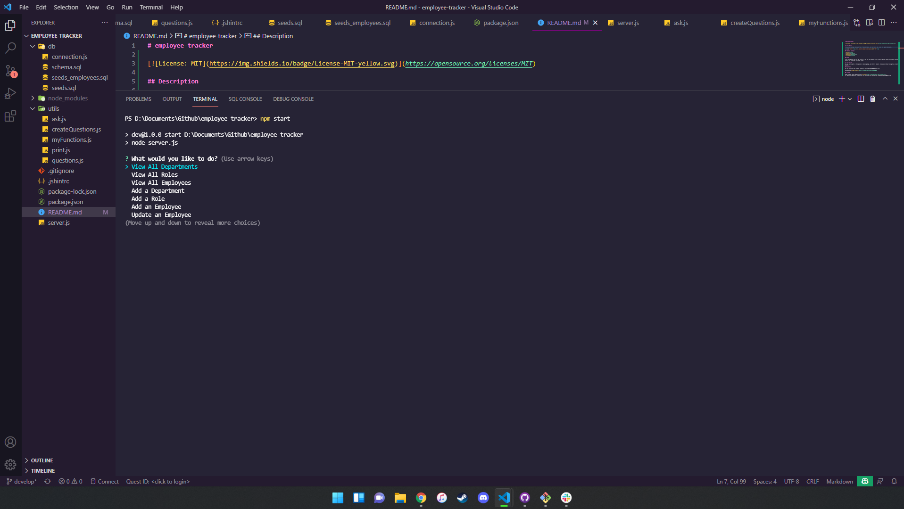

# employee-tracker

## Description

This project manages employee from a MySql database. Can currently add, view, and update employees.

## Table of Contents

- [Usage](#usage)
- [Credits](#credits)
- [Questions](#questions)
- [License](#license)

## Usage

Download or clone this repo and use npm install to get the node modules. This project requires MySql Local to be installed on your machine, please create your .env file and add your security credentials. Then run the schema.sql in the db folder.

## Contributing

You can participate in this project, submitting bugs, and feature request. Also you can help testing this project using jest. Also we want app authentication and authorization to this project.

## Questions

For any questions feel free to contact me at g@gmail.com

Checkout my [GitHub profile](https://github.com/gkowligi1392)

## License

Code released under the MIT License [License](https://choosealicense.com/licenses/mit/).
for additional questions please feel free to contact us via email at g@gmail.com